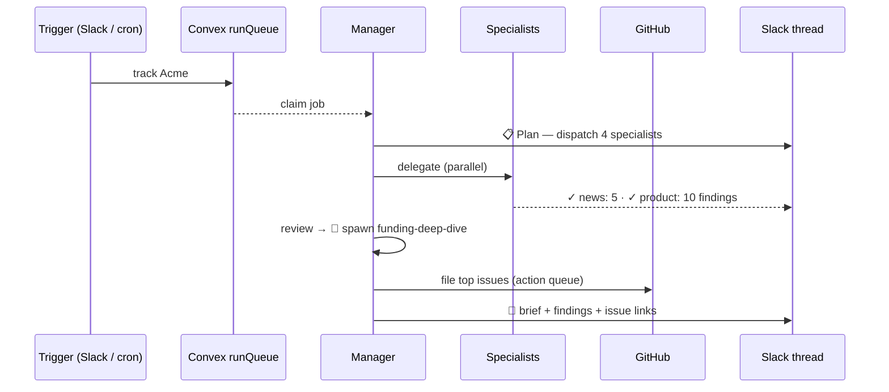

<div align="center">

# 🕵️ Stalker Hermes

### The AI agency that stalks your competitors so you don't have to.

A crew of AI agents watches competitors across **LinkedIn · X · News · Blogs · SEO**,
decides what actually matters, and **files the work** — turning findings into
**GitHub issues/PRs** and briefing you with text + voice. Hourly, and on demand.

<br/>


</div>

---

> **Every company watches competitors by hand** — someone skims LinkedIn, catches a launch
> on X, forwards a funding article, then forgets to act on it. **Stalker Hermes runs that
> entire job as a team of agents** and files the output where the team already works.

<div align="center">

### It doesn't just *tell* you — it *does the analyst's job*

**`watch → judge what matters → dedupe → threat-score → file GitHub issues → brief in Slack`**

</div>

---

## 🧠 Architecture

```mermaid
flowchart TB
    subgraph Triggers["🔔 Triggers — each drops a job in the queue"]
        CRON["⏰ Hermes cron<br/>(hourly, on the VM)"]
        SLACK["💬 Slack /stalker"]
        TG["📱 Telegram<br/>(Hermes skill)"]
        CF["☁️ Cloudflare cron<br/>(backup)"]
    end

    subgraph Convex["🟥 Convex — live backend (serverless)"]
        Q[("runQueue")]
        STATE[("competitors · trackers<br/>runs · traces · findings<br/>actionItems · signups")]
    end

    subgraph VM["🖥️ Azure VM — Python agent (systemd, 24/7)"]
        MGR["🧭 Manager agent<br/>plans · delegates · reviews"]
        SPEC["🔎 Specialists<br/>LinkedIn · X · News · Blog · SEO · Product"]
        SUB["🔬 Dynamic sub-specialists<br/>spawned on notable findings"]
    end

    subgraph Out["📤 Real output"]
        GH["🐙 GitHub issues / PRs<br/>(the action queue)"]
        SLACKOUT["💬 Slack brief + 🔊 voice"]
    end

    PG[("🐘 Postgres<br/>source of truth")]
    LINKUP["🌐 Linkup<br/>live web search"]

    CRON & SLACK & TG & CF -->|enqueue| Q
    Q -->|subscribe| MGR
    MGR --> SPEC --> SUB
    SPEC <-->|search| LINKUP
    SUB <-->|deep search| LINKUP
    MGR -->|dual-write| PG
    MGR -->|mirror| STATE
    MGR --> GH
    MGR --> SLACKOUT

    style Convex fill:#2a1215,stroke:#EE342F
    style VM fill:#0d1b2a,stroke:#4A90D9
    style Out fill:#0f2417,stroke:#16a34a
    style Triggers fill:#1a1625,stroke:#6E56CF
```



> The VM only exposes port 22 — **nothing calls into it.** Every trigger drops a row in the
> Convex `runQueue`; the agent subscribes. No inbound ports, no webhooks to the VM.

### What one run looks like



---

## 👥 The crew

| Agent | Role |
| :-- | :-- |
| 🧭 **Manager** | Reads the request, picks the channels worth running (not reflexively all), delegates, reviews the high-severity findings, spawns deep-dives, decides what becomes GitHub work, and writes the brief. |
| 🔎 **Specialists** ×6 | One per channel — LinkedIn · X · News · Blog · SEO · Product. Each runs a bounded tool-calling loop over **Linkup** live search, then extracts structured findings. |
| 🔬 **Sub-specialists** | Dynamic roles the manager invents at runtime (e.g. `funding-arr-deep-dive`) to corroborate or quantify a notable finding. |

**Three-layer memory** carries context through the run: **now** (this request) ·
**history** (this competitor's past findings, for dedup) · **rules** (the tracker's
channels, depth, spend cap, severity threshold).

Each finding is scored for **relevance** and **competitive threat** —
`ⓘ info · 🔵 low · 🟡 medium · 🟠 high · 🔴 critical` — and only the important ones
become GitHub work items and escalations.

---

## 🎛️ The interface

Stalker Hermes is driven entirely from **Slack** (Socket Mode — no public URL), with
**Telegram** control via a Hermes skill. Commands:

| Command | Does |
| :-- | :-- |
| `/stalker track <competitor> \| <focus>` | Run now — progress **streams live into a Slack thread** |
| `/stalker runs` | Recent runs with cost + latency |
| `/stalker run <id>` | Brief + findings + the GitHub issues it filed |
| `/stalker trace <id>` | The full agent **trace tree** — tokens + cost per step |
| `/stalker latest <competitor>` | Latest findings for one competitor |

A `track` streams the run in real time:
**`📋 Plan → ✓ news: 5 · ✓ product: 10 → 🔬 spawn deep-dive → 🧠 synthesize → brief`**

---

## 🔬 Observability

Every agent / tool / LLM step emits a **trace event** — parent/child, model, tokens,
cost, latency, status — to Postgres + Convex. `/stalker trace <id>` renders the whole
tree (manager → specialists → sub-specialists) with **tokens and cost per step**, and a
per-run **spend cap** halts delegation before it overruns. Nothing the crew does is a
black box.

---

## 🧩 Tech stack

<div align="center">

| Layer | Choice |
| :-- | :-- |
| 🤖 Agent crew | **Python 3.12** · OpenAI `gpt-5.5` (tool-calling + structured output) |
| 🌐 Live search | **Linkup** — per-specialist web search |
| 🟥 Config + live mirror | **Convex** (serverless, reactive) |
| 🐘 Warehouse | **Azure Postgres** · SQLAlchemy + Alembic |
| 💬 Surface | **Slack** Socket Mode + **ElevenLabs** voice briefs |
| 🧭 Harness | **Hermes** on the VM — Telegram, hourly cron, memory |
| ☁️ Landing | **Next.js** + Tailwind + shadcn on **Cloudflare** — auth, live signup counter, **Dodo** Pro checkout |

</div>

---

## 📁 Repository layout

```
stalker-hermes/
├── agent/            🐍 Python crew, pipeline, store, Slack app, evals, Alembic  (runs on the VM)
├── convex-backend/   🟥 Convex schema + functions (queue, traces, findings, actions, auth)
├── landing/          ☁️ Next.js landing — auth, live signup count, Dodo checkout → Cloudflare
├── workers/          ☁️ Cloudflare Worker — signup capture, Dodo webhook, backup cron
├── hermes/           🧭 Hermes `stalker` skill (Telegram control → Python CLI)
├── infra/            🛠️ Azure Postgres provisioning + VM deploy scripts
└── docs/             📄 Design spec
```

---

## ⚡ Run locally

Requires `.env` (see `.env.example`) with `OPENAI_API_KEY`, `LINKUP_API_KEY`,
`CONVEX_URL`, Postgres `PG*`, and Slack tokens.

```bash
cd agent
uv venv && uv pip install -e .

uv run python -m stalker.cli once "OpenAI" "recent launches"   # one-shot run
uv run python -m stalker.cli serve                             # queue + Slack daemon
uv run python -m stalker.evals.run_evals                       # CI eval gate
```

In production the daemon runs as a **systemd** service on the VM (`infra/` has the
deploy script) and the **Hermes hourly cron** enqueues a sweep each hour.

---

## 🏆 Track 03 — how it scores

<div align="center">

| Parameter | Weight | How it's met |
| :-- | :--: | :-- |
| **Real output shipping** | `20×` | Hourly + on-demand → GitHub issues/PRs + Slack briefs on real surfaces |
| **Observability** | `7×` | Full trace tree with per-step tokens + cost via `/stalker trace` |
| **Agent org** | `5×` | Manager plans/delegates per request; spawns sub-specialists dynamically |
| **Evaluation** | `5×` | Named eval set + CI gate that fails on pass-rate regression |
| **Handoffs / memory** | `2×` | 3-layer memory passed manager → specialists |
| **Cost / latency** | `1×` | Bounded specialist loops + per-run spend cap |
| **Management UI** | `1×` | Define a competitor + tracker role (channels, depth, caps, threshold) |

**Power-ups:** Linkup · Convex · Cloudflare · ElevenLabs · Dodo · Wispr Flow
&nbsp;•&nbsp; **Harness:** Hermes (Telegram · cron · memory)

</div>

---

## 📝 Notes

- `gpt-5.5` per-token pricing in `agent/stalker/config.py` are placeholders (override via
  `PRICE_IN_*` / `PRICE_OUT_*`); cost *accounting* is structurally correct.
- Secrets live only in `.env` (gitignored) — see `.env.example` for the full list.
- The Azure VM + Postgres are torn down post-hackathon; **Convex and the Cloudflare
  landing stay live** (serverless / free tier), so sign-up + the live counter keep working.

<div align="center">
<br/>
<sub>Built with 🕵️ for the GrowthX Hermes Buildathon · Track 03 — AI as Agency</sub>
</div>

